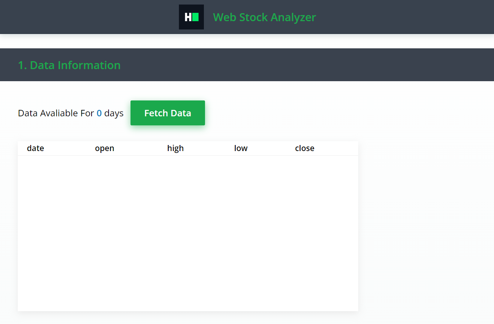
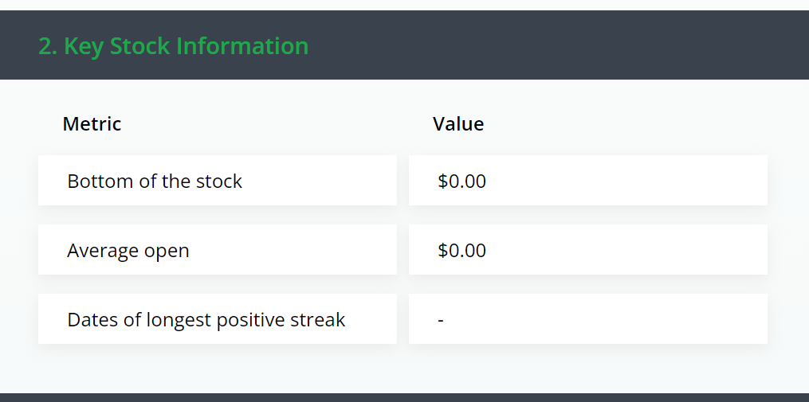

# Lab49 Stock Analyzer - React 2.0
**Description**
During this interview you are required to develop an app called *Stock Analyzer* in React framework using Typescript. It's an application that helps traders to get valuable information from historic stock data. The application consists of two parts. These parts are detailed below with specific description and requirements. The submitted solution must use React and Typescript. Besides this you are free to use any paradigm, tool or package to develop the application. The choice of these items along with code quality will both affect your end result as a candidate. Code and file structure is up to your discretion. **Good luck!**
 
### I. Data fetch
 
In this section the trader can fetch all the available data for the stock.
 
The stock information can be found at  *https://jsonmock.hackerrank.com/api/stocks* *.* It contains the stock related information for multiple years. Given the large data set, **the API is paginated**. Pages can be queried using page query parameter.
 
Considering the above information implement the following:
* Add a button to the UI, that when pressed fetches the stock information from all the API pages.
* After all the data is fetched, the button should be disabled.
* Display how many days of information we have for the stock.
* The retrieved data shall be presented to the user, inside a table.

⠀ 
**Below you can find a UX design for this segment:**

### II. Key stock information
 
After having all the necessary data points, the application calculates key stock information, and displays it in a table. The table consists of a header section and the calculated result for the below items:
**1. Bottom of the stock:** Calculate what was the lowest value for the stock.
**2. Average open:** Calculate the average open in 2006.
**3. Longest positive streak:** Calculate the longest continuous date span between which the close value of the stock was higher than the open one. You shall display the two dates, not the span length. 
 
See below for UX guidance:

